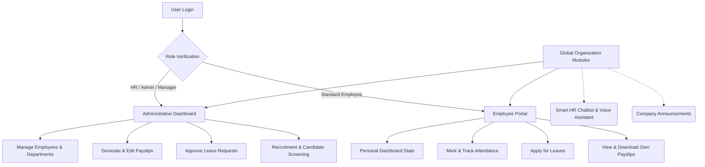
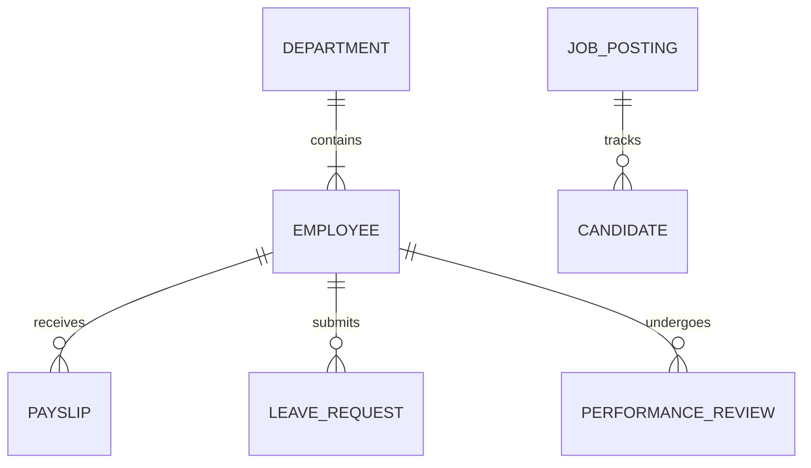

# Next-Gen HRMS Platform

A comprehensive, role-based Human Resource Management System (HRMS) built with Next.js, React, and modern UI paradigms. It streamlines organization-wide operations, from employee management and payroll to recruitment, attendance, and intelligent HR assistance.

## System Architecture & User Flow



## Data Entity Flow



## Key Modules & Capabilities

### 1. Advanced Role-Based Access Control (RBAC)
- **Granular Permissions:** The application renders dynamic interfaces based on the logged-in user's role (Admin, HR, Manager, or standard Employee).
- **Secure Views:** Strict data isolation ensures employees can only view their own confidential data (e.g., payslips, leave balances), while HR management gets full organizational oversight.

### 2. Streamlined Payroll Management
- **Salary Structures:** Visual breakdowns of Monthly CTC, Gross Salary, and Net Take-Home Salary.
- **Dynamic Payslip Generation:** HR personnel can effortlessly generate custom payslips with automated net salary computation handling earnings and tax deductions.
- **Export Ready:** One-click PDF report and payslip downloads.

### 3. Smart Recruitment & ATS
- **Job Postings:** Manage active job listings and track applications.
- **Candidate Pipeline:** Move applicants seamlessly through various interview stages.
- **Intelligent Screening:** Built-in capabilities to match candidate resumes against job requirements, yielding objective compatibility scorecards to aid hiring decisions.

### 4. Next-Generation HR Tools
- **Voice-Enabled Assistant:** Built-in speech-to-text and text-to-speech engine allowing employees to audibly ask HR policy questions and get immediate answers.
- **Context-Aware Knowledge Base:** Reliable query handling ensures users receive accurate information on leaves, notice periods, and salary dates seamlessly.
- **Sentiment & Performance Analytics:** Advanced metrics to analyze employee feedback sentiment and forecast performance trajectories based on historical attendance and review data.

### 5. Attendance & Leave Tracking
- **Visual Analytics:** Beautiful, interactive graphs track weekly and monthly attendance records across the organization.
- **Leave Workflows:** Streamlined approval flows for sick leaves, casual leaves, and Work-From-Home requests.

## Technology Stack

- **Core Framework:** [Next.js](https://nextjs.org/) (React App Router)
- **Styling:** Custom Vanilla CSS with modern Glassmorphism aesthetics and responsive design tokens.
- **Data Visualization:** Recharts for dynamic analytics rendering.
- **State Management:** React Hooks and Context API for global authentication and user state.

## Getting Started

1. **Install Dependencies:**
   ```bash
   npm install
   ```

2. **Environment Variables:**
   Create a `.env.local` file in the root folder and add your Gemini API Key for the AI tools:
   ```env
   NEXT_PUBLIC_GEMINI_API_KEY=your_key_here
   ```

3. **Run the Development Server:**
   ```bash
   npm run dev
   ```

4. **Access the Platform:**
   Open `http://localhost:3000` in your browser. Default mock login credentials are provided in the source (`admin@fwcit.com` / `admin123`).
